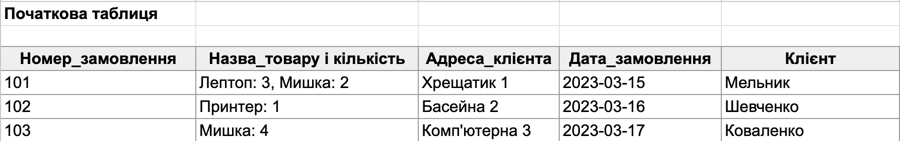
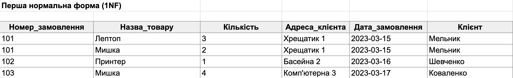
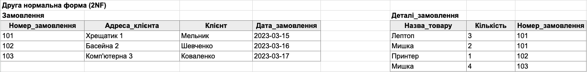
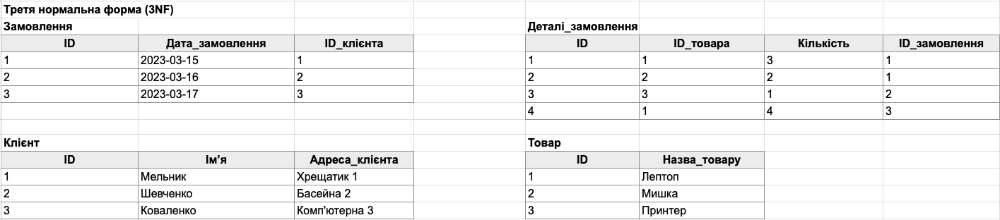
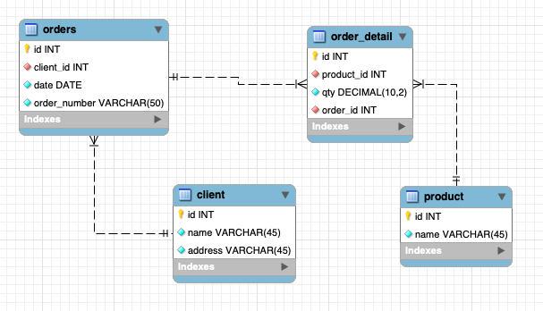

# Requirements

1. Переведіть початкову таблицю в першу нормальну форму.
2. Переведіть нові таблиці в другу нормальну форму.
3. Переведіть нові таблиці в третю нормальну форму.
4. Розробіть ER-діаграму отриманих таблиць.
5. Використовуючи ER-діаграму, створіть таблиці в базі даних. Оформіть ці таблиці без конкретних значень, тільки з урахуванням колонок та їхніх зв'язків, вручну або автоматично.
6. Використано зрозумілі та конкретні імена для сутностей та атрибутів. Уточнено типи даних для атрибутів. Усі відношення й атрибути мають чіткі і зрозумілі кардинальності та значення.
7. Створено таблиці в базі даних (тільки таблиці й колонки з урахуванням зв'язків) вручну або автоматично.

# Початкова таблиця

# Перша нормальна форма (1NF)

# Друга нормальна форма (2NF)

# Третя нормальна форма (3NF)
**Note:**  
Original order numbers (101, 102, 103) were replaced with technical IDs (1, 2, 3) as primary keys for normalization.

# ER-діаграма

# Таблиці в базі даних
